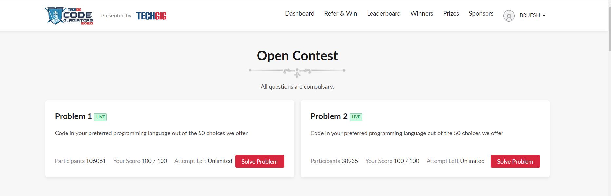
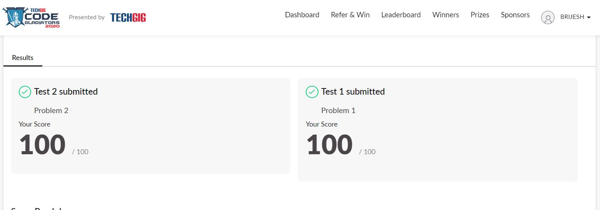

# TECHGIG_OPEN_CODING_CONTEST
This repository contains the problems as well as their accepted solution asked in the TechGiG Open Coding Contest.

=> SOLVED PROBLEMS

  
  
  

=> C++ SKILL CERTIFICATE

  
